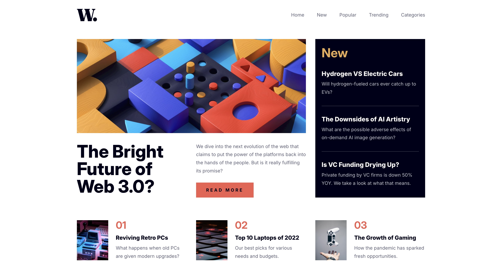

# Frontend Mentor - News homepage solution

This is a solution to the [News homepage challenge on Frontend Mentor](https://www.frontendmentor.io/challenges/news-homepage-H6SWTa1MFl). Frontend Mentor challenges help you improve your coding skills by building realistic projects.

## Table of contents

-   [Overview](#overview)
    -   [The challenge](#the-challenge)
    -   [Screenshot](#screenshot)
    -   [Links](#links)
-   [My process](#my-process)
    -   [Built with](#built-with)
    -   [What I learned](#what-i-learned)
    -   [Continued development](#continued-development)
    -   [Useful resources](#useful-resources)
-   [Author](#author)

**Note: Delete this note and update the table of contents based on what sections you keep.**

## Overview

### The challenge

Users should be able to:

-   View the optimal layout for the interface depending on their device's screen size
-   See hover and focus states for all interactive elements on the page

### Screenshot



### Links

-   Solution URL: [https://github.com/Joshk7/news-homepage](https://github.com/Joshk7/news-homepage)
-   Live Site URL: [https://news-homepage-ten-rho.vercel.app](https://news-homepage-ten-rho.vercel.app)

## My process

### Built with

-   Semantic HTML5 markup
-   CSS custom properties
-   Flexbox
-   CSS Grid
-   Mobile-first workflow

### What I learned

I learned about the dialog tag in html.

```html
<dialog>...</dialog>
```

This native element is very useful for creating modals and has an easy way to style the backdrop when the dialog modal is opened using css.

```css
dialog::backdrop {
    background: var(--dark-space-blue);
    opacity: 0.5;
}
```

Additionally, the javascript to make the modal work is very simple.

```js
const handleOpen = (e) => {
    openMenu.ariaExpanded = true;
    dialog.showModal();
}

const handleClose = (e) => {
    openMenu.ariaExpanded = false;
    dialog.close();
}

const handleLink = (e) => {
    openMenu.ariaExpanded = false;
    dialog.close();
}
```

All you have to remember is to use the .showModal() and .close methods and attach them to the appropriate buttons and it will work!

### Continued development

I tried my best to add aria labels where I thought was necessary, but I could look into better labelling for the future.

### Useful resources

-   [The Dialog Element](https://developer.mozilla.org/en-US/docs/Web/HTML/Element/dialog) - This resource helped me integrate the dialog element into this project.

## Author

-   Website - [Joshua Kahlbaugh](https://joshuakahlbaugh.pages.dev)
-   Frontend Mentor - [@Joshk7](https://www.frontendmentor.io/profile/Joshk7)
